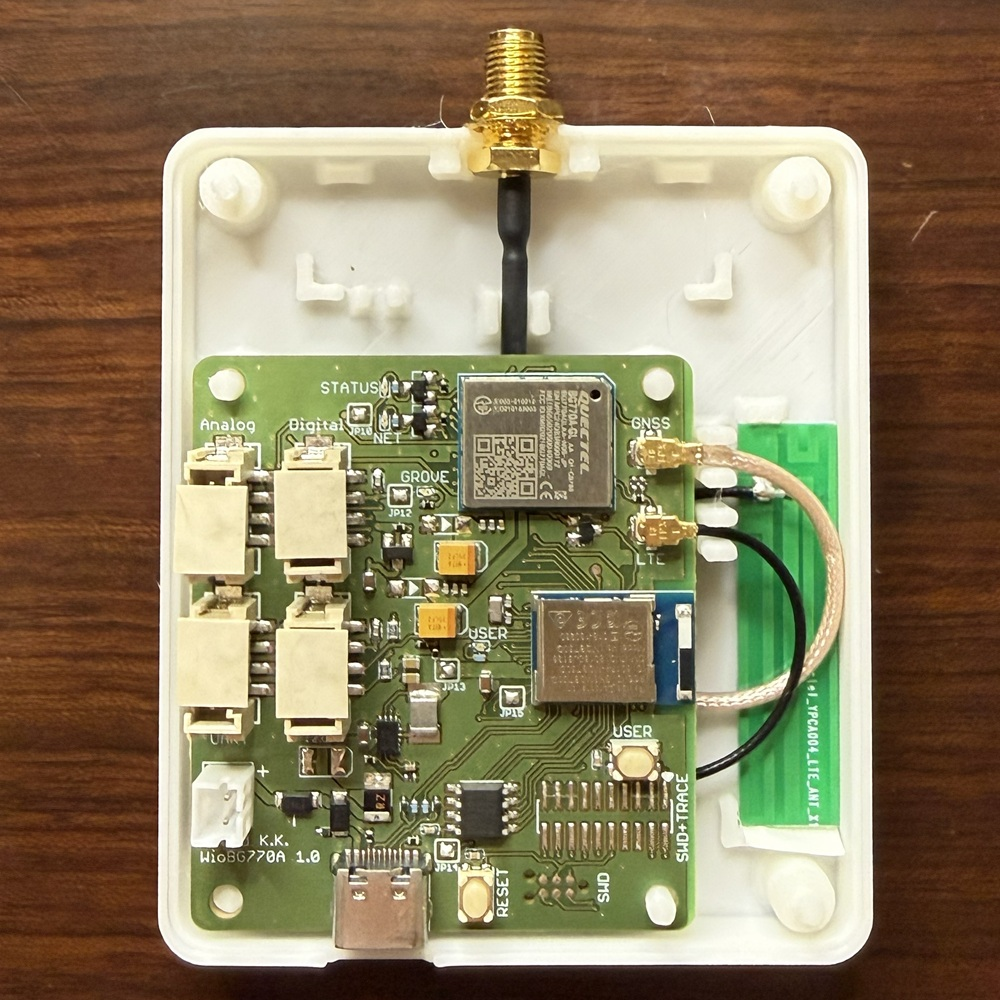

# Wio BG770A Accessories

## Case / Enclosure

### Case Type 1

#### Parts

* x1 [Bottom cover](case/case_type1_bottom.stl)
* x1 [Top cover](case/case_type1_top.stl)
* x4 [M3x12 plastic pan head screw](https://akizukidenshi.com/catalog/g/g103583/)
* x4 [M3 plastic hex nut](https://akizukidenshi.com/catalog/g/g103584/)

### Case Type 2

#### Parts

* x1 [Bottom cover](case/case_type2_bottom.stl)
* x1 [Top cover](case/case_type2_top.stl)
* x1 [User sw](case/case_type2_user_sw.stl)
* x1 [Rst sw](case/case_type2_rst_sw.stl)

## Holder

### Holder Type 1

#### Parts

* x1 [Holder](holder/holder_type1.stl)
* x4 [M3 tapping screw EM-3](https://www.takachi-el.co.jp/products/EM)

## Antenna Holder

### Antenna Holder Type 1

This antenna holder is designed for use with Case Type 1.

#### Parts

* x1 [Antenna holder](antenna_holder/antenna_holder_type1.stl)

### Rod Antenna Holder Type 1

Rod antenna is [here](https://soracom.jp/store/5286/).
This antenna holder is designed for use with Case Type 1.

#### Parts

* x1 [Rod antenna holder](antenna_holder/rodantenna_holder_type1.stl)
* x1 [Rod antenna](https://soracom.jp/store/5286/)
